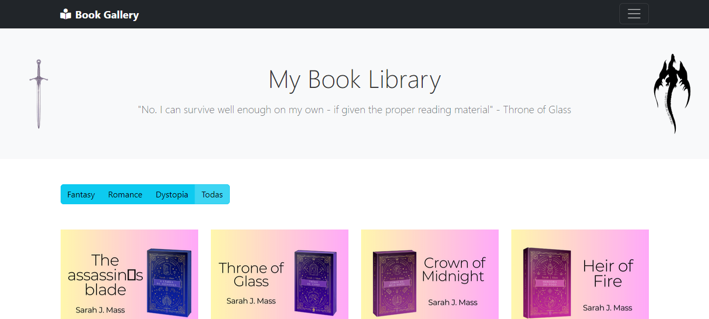

Projeto de Galeria utilizando bootstrap/jquary/webpack


# Nome do projeto




> Linha adicional de texto informativo sobre o que o projeto faz. Sua introdução deve ter cerca de 2 ou 3 linhas. Não exagere, as pessoas não vão ler.

### Ajustes e melhorias

O projeto ainda está em desenvolvimento e as próximas atualizações serão voltadas para as seguintes tarefas:

- [x] Tarefa 1
- [x] Tarefa 2
- [x] Tarefa 3
- [ ] Tarefa 4
- [ ] Tarefa 5

## 💻 Pré-requisitos

Antes de começar, verifique se você atendeu aos seguintes requisitos:

- Você instalou a versão mais recente de `<linguagem / dependência / requeridos>`
- Você tem uma máquina `<Windows / Linux / Mac>`. Indique qual sistema operacional é compatível / não compatível.
- Você leu `<guia / link / documentação_relacionada_ao_projeto>`.

## 🚀 Instalando <nome_do_projeto>

Para instalar o <nome_do_projeto>, siga estas etapas:

Linux e macOS:

```
<comando_de_instalação>
```

Windows:

```
<comando_de_instalação>
```

## ☕ Usando <nome_do_projeto>

Para usar <nome_do_projeto>, siga estas etapas:

```
<exemplo_de_uso>
```

Adicione comandos de execução e exemplos que você acha que os usuários acharão úteis. Forneça uma referência de opções para pontos de bônus!

## 📫 Contribuindo para <nome_do_projeto>

Para contribuir com <nome_do_projeto>, siga estas etapas:

1. Bifurque este repositório.
2. Crie um branch: `git checkout -b <nome_branch>`.
3. Faça suas alterações e confirme-as: `git commit -m '<mensagem_commit>'`
4. Envie para o branch original: `git push origin <nome_do_projeto> / <local>`
5. Crie a solicitação de pull.

Como alternativa, consulte a documentação do GitHub em [como criar uma solicitação pull](https://help.github.com/en/github/collaborating-with-issues-and-pull-requests/creating-a-pull-request).

